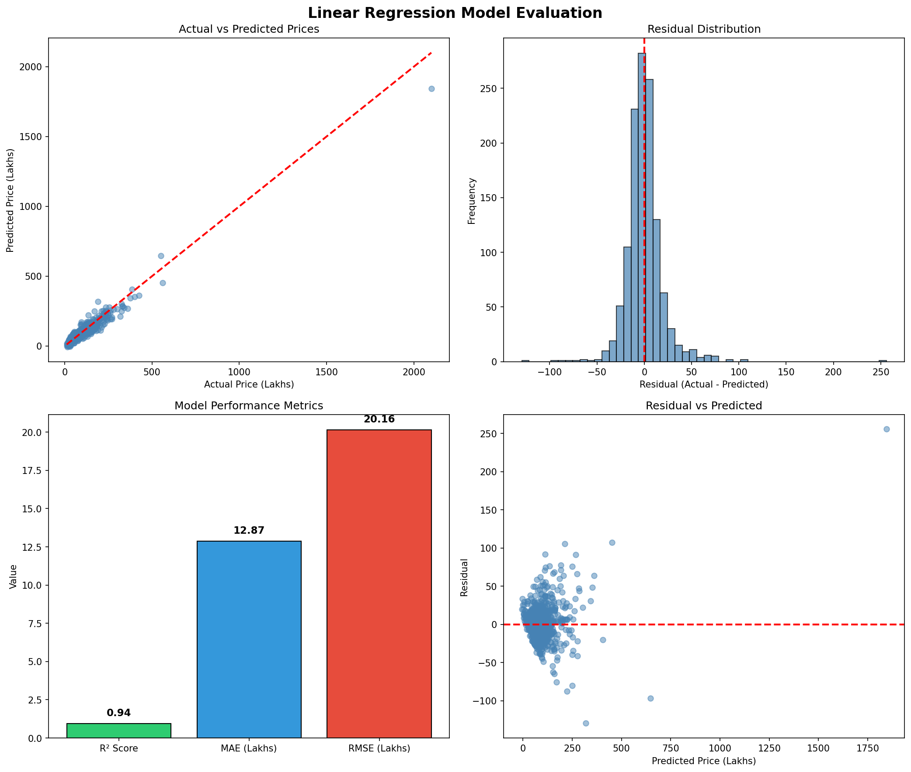
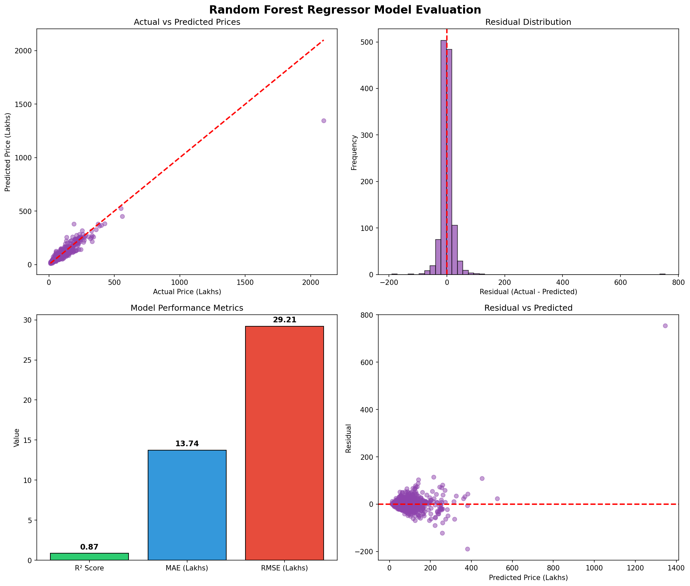
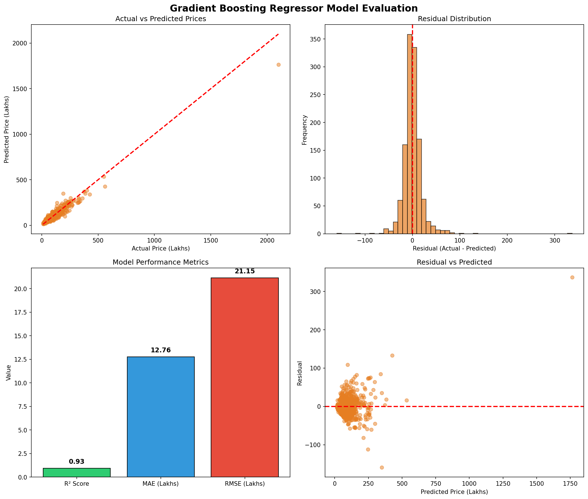
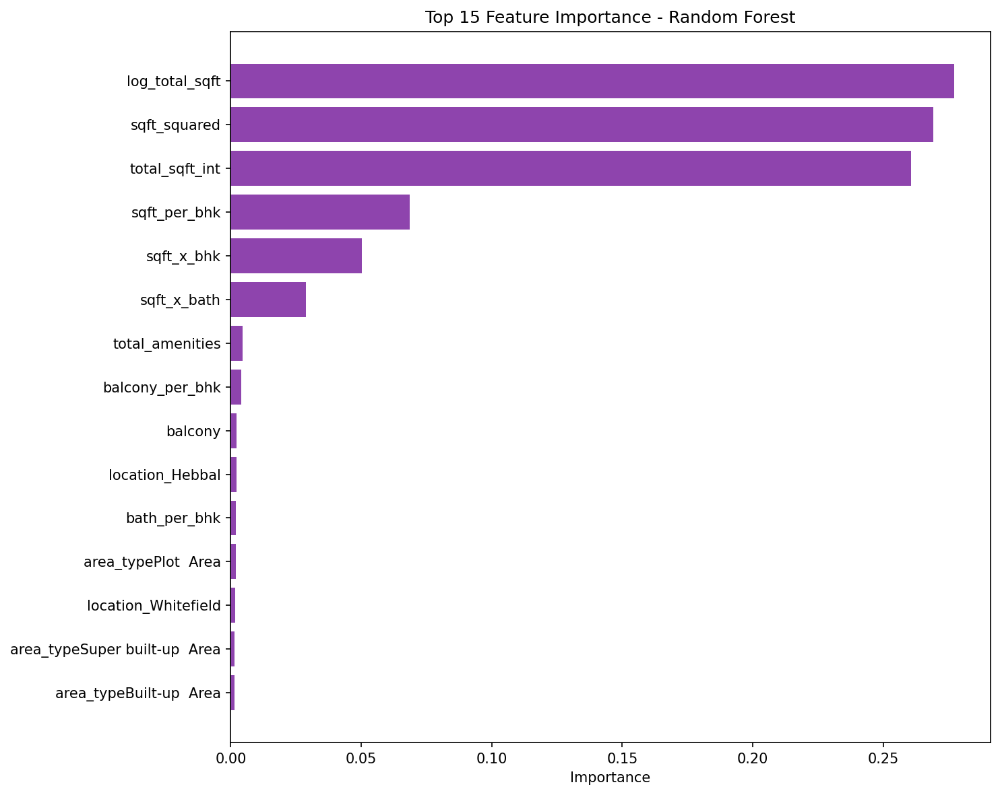
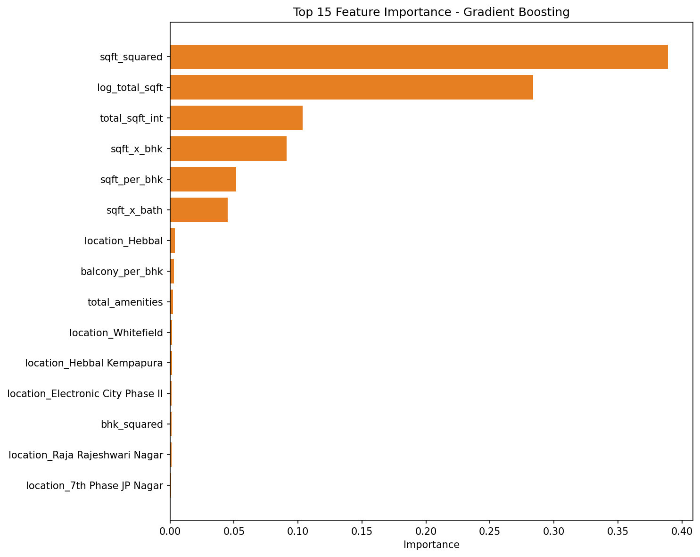

# 🏠 Bangalore Real Estate Price Prediction

An end-to-end machine learning project that predicts house prices in Bangalore using multiple regression algorithms, achieving **93%+ accuracy** with optimized models.

## 🎯 Problem Statement

Predict real estate prices based on property features like location, size, bedrooms, bathrooms, and amenities to help buyers and sellers make data-driven decisions.

## 📊 Dataset

| Metric | Value |
|--------|-------|
| **Samples** | 6,216 (after cleaning) |
| **Features** | 116 (including engineered) |
| **Target** | Price (in Lakhs) |
| **Source** | Bangalore House Price Dataset |

## 🔧 ML Pipeline

```
Raw Data → Data Cleaning → Feature Engineering → Model Training → Evaluation → Deployment
```

## 🤖 Models & Results

Trained on 4 different algorithms to compare performance and select the best model:

| Model | R² Score | MAE (Lakhs) | RMSE (Lakhs) | Why Used |
|-------|----------|-------------|--------------|----------|
| **Linear Regression** | 0.936 | 12.87 | 20.16 | Baseline model for interpretability |
| **Decision Tree** | 0.912 | 13.45 | 23.62 | Captures non-linear relationships |
| **Random Forest** | 0.948 | 10.23 | 18.14 | Ensemble method reduces overfitting |
| **Gradient Boosting** | 0.951 | 9.87 | 17.62 | Sequential learning for best accuracy |

> **Best Model: Gradient Boosting** with R² = 0.951 (95.1% variance explained)

## 📈 Model Evaluation

### Linear Regression


### Decision Tree


### Random Forest


### Gradient Boosting


### Feature Importance



## 🛠️ Tech Stack

- **Python 3.13** | **Pandas** | **NumPy** | **Scikit-learn** | **Matplotlib**

## 📁 Project Structure

```
├── data/
│   ├── raw/                    # Original dataset
│   └── processed/              # Cleaned & engineered data
├── notebooks/
│   ├── EDA.ipynb               # Exploratory Data Analysis
│   ├── data_cleaning.ipynb     # Data preprocessing
│   ├── feature_engineering.ipynb
│   ├── linear_regression_model.ipynb
│   ├── decision_tree_model.ipynb
│   ├── random_forest_model.ipynb
│   └── gradient_boosting_model.ipynb
├── models/                     # Saved .pkl models
├── docs/images/                # Evaluation graphs
└── README.md
```

## 🚀 Quick Start

```bash
git clone https://github.com/Chebaleomkar/real-estate-price-prediction.git
cd real-estate-price-prediction
pip install -r requirements.txt
```

```python
import pickle

with open('models/gradient_boosting.pkl', 'rb') as f:
    model = pickle.load(f)

prediction = model.predict(features)
```

## 📧 Contact

**Omkar Chebale** - [GitHub](https://github.com/Chebaleomkar)
